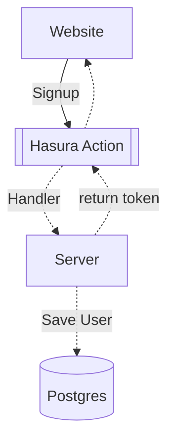
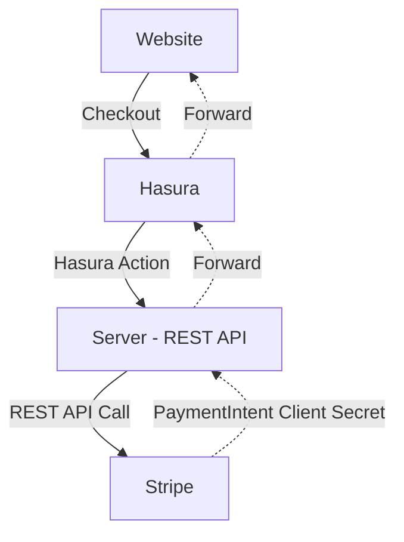

# Hasura Super App

To test this application, see the [Setup](Setup.md) docs.
<!-- vscode-markdown-toc -->

- [Hasura Super App](#hasura-super-app)
  - [Introduction](#introduction)
  - [Getting Started](#getting-started)
  - [2 Minute Video Demo](#2-minute-video-demo)
  - [Application Technical Overview](#application-technical-overview)
  - [Application Architectural Overview](#application-architectural-overview)
    - [Authentication Flow](#authentication-flow)
    - [Checkout Flow](#checkout-flow)
    - [Product Management Flow](#product-management-flow)
    - [GraphQL SDK](#graphql-sdk)
    - [Hasura Migration Flow](#hasura-migration-flow)
    - [3 Factor Applications](#3-factor-applications)

<!-- vscode-markdown-toc-config
	numbering=false
	autoSave=true
	/vscode-markdown-toc-config -->
<!-- /vscode-markdown-toc -->


> **Disclaimer/Notice:** This application was a passion project for a number of engineers and other team members internally. Initial developments began long prior to v2.0 releases and before the Metadata V3 spec. As you might assume given the circumstances, there are some irregularitaries in the codebase, and small parts of the UI/design exist solely for aesthetic purposes/inspiration. Our hope was that the "big picture" product here could be useful for others both as a learning exercise or quick reference for particular featuresets. We wish and intend to continue to build out & integrate features of Hasura so that this repo can serve as a cannonical community reference for whatever your implementation/architecture question is.

## Introduction

The Hasura Super App is a full featured reference application demonstrating many of the powerful featues of Hasura's GraphQL Engine. This is free and open software and you are invited to take and use as much of it as you would like, though it was designed for educational purposes.


## Getting Started

tl;dr = Clone the repo, run Docker.

```sh-session
$ git clone https://github.com/hasura/hasura-ecommerce
$ cp .env.example .env
<modify ".env" to have your real Stripe test keys if you want checkout to work>
$ docker-compose up -d
$ cd hasura
<assuming you have Hasura CLI installed>
$ hasura seeds apply 

Visit http://localhost:3000 for Next.js frontend
Visit http://localhost:8060 for Hasura console (admin secret = "my-secret")
Visit http://localhost:9000 for Minio dashboard (login = "minio:minio123")
```


## 2 Minute Video Demo

https://user-images.githubusercontent.com/26604994/125822361-44faf3f2-a8a1-47a3-8ddf-52ccdf801f20.mp4

## Application Technical Overview
This example is a dockerized project with the following services: Postgres, GraphQL Engine, Minio, and Next.js. The project has one external service dependency for payment handling, which we've chosen to implement with Stripe. User authentication and authorization, cart management, order management and product information management is stored in Postgres and architected through Hasura GraphQL Engine. Minio is utilized for asset storage as it implements a common S3 interface.

| Service  | Functionality                                                                | Licensing |
| -------- | ---------------------------------------------------------------------------- | --------- |
| Postgres | PIM, Cart Management, User Management, User Authentication, Order Management | OSS       |
| Hasura   | Business Logic Routing, Unified API, Access Control Management               | OSS       |
| NextJS   | Serverless business logic handlers, web application framework                | OSS       |
| Minio    | S3-compatible object storage (file and image upload)                         | OSS       |
| Stripe   | Payment handling                                                             | Freemium  |

## Application Architectural Overview
See the [Architecture Documentation.](Architecture.md)


### Authentication Flow

The Authentication leverages Hasura Actions and NextJs serverless routes to handle JWT based authentication. The client sends a login mutation, the mutation is forwarded via action to a serverless function where a unique JWT is created, the token is passed back to Hasura where it is stored with client credentials, and the JWT along with helpful client information is forwarded back to the client and set as a sever-set cookie.

The login flow is similar but instead of creating a user in the action, the user is verified.

[](https://mermaid-js.github.io/mermaid-live-editor/#/edit/eyJjb2RlIjoiZ3JhcGggVERcbiAgICB3ZWJzaXRlW1dlYnNpdGVdXG4gICAgaGFzdXJhWyhQb3N0Z3JlcyldXG4gICAgc2VydmVyW1NlcnZlcl1cbiAgICBhY3Rpb25bW0hhc3VyYSBBY3Rpb25dXVxuICAgIFxuICAgIHdlYnNpdGUgLS0-fFNpZ251cHwgYWN0aW9uXG4gICAgYWN0aW9uIC0uLT58SGFuZGxlcnwgc2VydmVyXG4gICAgc2VydmVyIC0uLT4gfFNhdmUgVXNlcnwgaGFzdXJhXG4gICAgc2VydmVyIC0uLT4gfHJldHVybiB0b2tlbnwgYWN0aW9uXG4gICAgYWN0aW9uIC0uLT4gd2Vic2l0ZSIsIm1lcm1haWQiOnsidGhlbWUiOiJkZWZhdWx0In0sInVwZGF0ZUVkaXRvciI6ZmFsc2V9)


### Checkout Flow

- User visits the Checkout page, presses payment button
- GraphQL request is sent to Hasura to invoke custom Hasura Action
- Hasura forwards the request parameters to the Action REST API handler on the Next.js Server
- The API handler calls the Stripe API and invokes `stripe.paymentIntents.create()`, then returns the `client_secret` for the tokenized PaymentIntent
- Hasura forwards the response from the Action REST API handler to the client, as GraphQL

[](https://mermaid-js.github.io/mermaid-live-editor/#/edit/eyJjb2RlIjoiZ3JhcGggVERcbiAgICB3ZWJzaXRlW1dlYnNpdGVdXG4gICAgc2VydmVyW1NlcnZlciAtIFJFU1QgQVBJXVxuICAgIGhhc3VyYVtIYXN1cmFdXG4gICAgc3RyaXBlW1N0cmlwZV1cblxuICAgIFxuICAgIHdlYnNpdGUgLS0-fENoZWNrb3V0fCBoYXN1cmFcbiAgICBoYXN1cmEgLS0-IHxIYXN1cmEgQWN0aW9ufCBzZXJ2ZXJcbiAgICBzZXJ2ZXIgLS0-IHxSRVNUIEFQSSBDYWxsfCBzdHJpcGVcbiAgICBzdHJpcGUgLi0-IHxQYXltZW50SW50ZW50IENsaWVudCBTZWNyZXR8IHNlcnZlclxuICAgIHNlcnZlciAuLT4gfEZvcndhcmR8IGhhc3VyYVxuICAgIGhhc3VyYSAuLT4gfEZvcndhcmR8IHdlYnNpdGUiLCJtZXJtYWlkIjp7InRoZW1lIjoiZGVmYXVsdCJ9LCJ1cGRhdGVFZGl0b3IiOmZhbHNlfQ)



### Product Management Flow
Product management occurs through the `/admin` paths of the client application. New product images are uploaded to the Minio instance and the resource url is saved along with the product details. Again, as a client wrapper to a single GraphQL endpoint, it becomes very easy to expose additional functionality like PIM management without the need for incorporating excessive additional tooling.

### GraphQL SDK
This project uses an innovative, generated, GraphQl Client SDK. For more information, [see the SDK documentation.](www/utils/FluidGraphQL.md)

### Hasura Migration Flow
Hasura is a powerful backend provider that has offline development primitives baked in. You can define, iterate on, and deploy your migrations through the helpful CLI. For more information see the [migration guide.](hasura/README.md)

### 3 Factor Applications

This application follows the 3 Factor App principles which are composed of robust client-side state management and a centralized API layer that manages the business logic, architecture and service routing. For more information on 3 factor apps, [visit the website.](https://3factor.app/)

