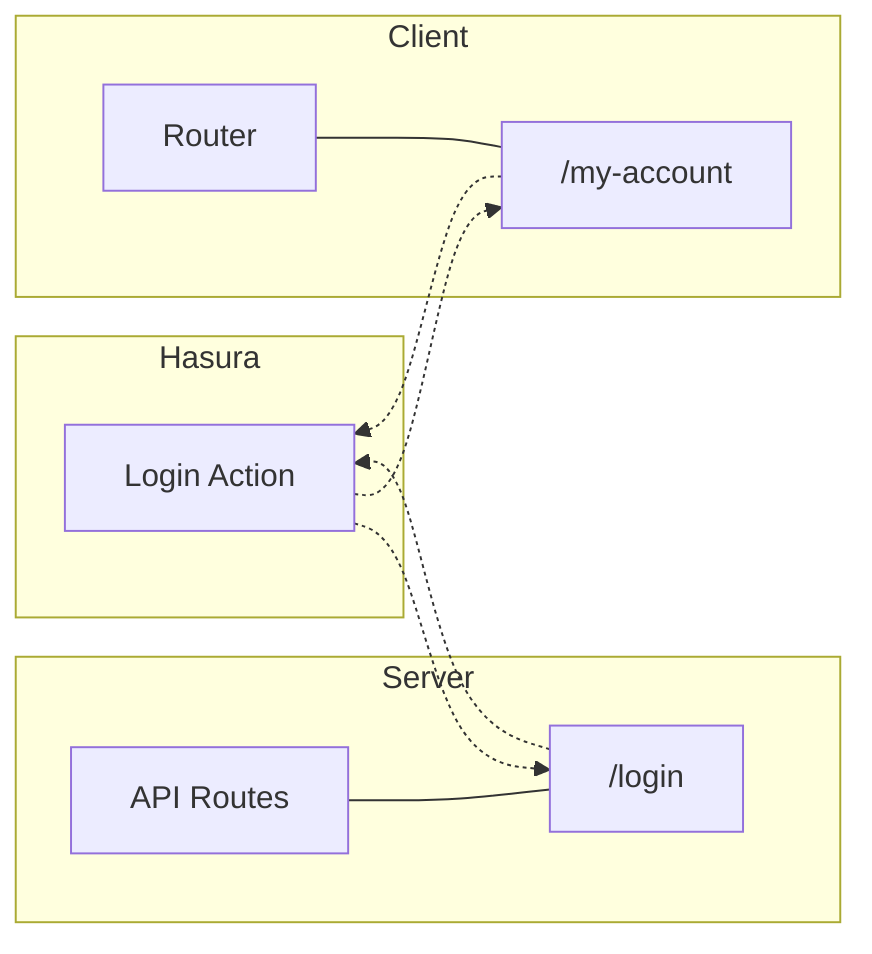

# Page Structure

The page organization in this project is a mixture of the frameworks opinion and our architectural choices.

<!-- vscode-markdown-toc -->
* [Framework Features](#FrameworkFeatures)
* [Directory Structure](#DirectoryStructure)
* [Applying the Patternn](#ApplyingthePatternn)

<!-- vscode-markdown-toc-config
	numbering=false
	autoSave=true
	/vscode-markdown-toc-config -->
<!-- /vscode-markdown-toc --> 

## <a name='FrameworkFeatures'></a>Framework Features

NextJs creates pages by default out of any javascript (typescript) file that it finds in the `/pages` directory. Typescript requires some extra configuration but it will walk you through a guided prompt if you are start from scratch. You can extend the framework behavior to include markdown files, text files, yaml files, or anything else the community wants to add. An exception to this one page equals one route architecture, is the the concept of dynamic routes.

Additionally, any file or folder prefixed with `_` will be omited from the compiler and available for imports only. This is helpful for utils and libs.

Lastly, any files in `/api` get converted into serverless functions that execute server side only - this means we have protected execution as well as the ability to collocate our serverless code alongside our client code for easy code reuse, debugging, and testing.


## <a name='DirectoryStructure'></a>Directory Structure

Our pages are broken into a directory for account activities, a directory for admin activities, indiviidual page lookups, individual category lookups, checkout and the index page. As mentioned above, everything inside `/api` is for server-side execution. Specifically in context of a Hasura project, we'll be mapping our actions to these handlers. Having them in the same project is simply a nice-to-have from the framework that allows us to reason about our project.

[](https://mermaid-js.github.io/mermaid-live-editor/#/edit/eyJjb2RlIjoiZmxvd2NoYXJ0IExSXG4gICAgc3ViZ3JhcGggSGFzdXJhXG4gICAgICAgIGxvZ2luX2FjdGlvbltMb2dpbiBBY3Rpb25dXG4gICAgZW5kXG4gICAgc3ViZ3JhcGggU2VydmVyXG4gICAgICAgIGFwaVtBUEkgUm91dGVzXVxuICAgICAgICBsb2dpbltcIi9sb2dpblwiXVxuICAgICAgICBhcGkgLS0tIGxvZ2luXG4gICAgZW5kXG4gICAgc3ViZ3JhcGggQ2xpZW50XG4gICAgICAgIHJvdXRlcltSb3V0ZXJdIC0tLSBhY2NvdW50W1wiL215LWFjY291bnRcIl1cbiAgICAgICAgXG4gICAgZW5kXG4gICAgXG4gICAgYWNjb3VudCAtLi0-IGxvZ2luX2FjdGlvblxuICAgIGxvZ2luX2FjdGlvbiAtLi0-IGxvZ2luXG4gICAgbG9naW4gLS4tPiBsb2dpbl9hY3Rpb25cbiAgICBsb2dpbl9hY3Rpb24gLS4tPiBhY2NvdW50IiwibWVybWFpZCI6e30sInVwZGF0ZUVkaXRvciI6ZmFsc2V9)




## <a name='ApplyingthePatternn'></a>Applying the Patternn
 
 Under the prodcuts directory you'll find the path `/product/[product].js`. This acts as a wild card so that any path such as `/products/cool-product` and `/products/123` will respectively send the matching segment (cool-product and 123) to that page handler as as request paramter called product. For example, `/products/cool-product` will be available in the pages data fetching mechanism as
```js
{req: {params: { product: 'cool-product' }}}
```

This allows us to create generic handlers for all products and categories. Using the framework's server-side fetching handlers, we can query content from Hasura using those parameters and GraphQL.

```js
export async function getServerSideProps(context) {
  const { params } = context;
  const { product } = params;

  const { product_by_pk } = await client.query({
    product_by_pk: [
      {
        id: product,
      },
      {
        id: true,
        name: true,
        description: true,
        price: true,
        image_urls: true,
        brand: true,
        category: {
          name: true,
          display_name: true,
        },
      },
    ],
  });

  return {
    props: {
      ...product_by_pk,
    },
  };
}
```