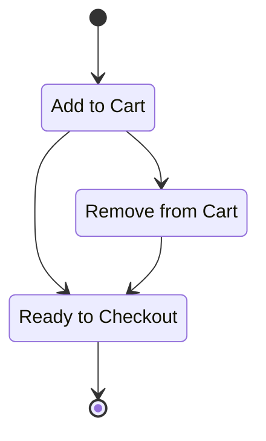

# State Management

State management is a critical area of focus for modern applications. Generally speaking, the modern application will have many types of state in play. You can have data state, which represents a slice of content from your server, interaction state, which may be something a customer is doing with that data on your machine that may or may not need persistence, and then you have UI state which handles things like if a menu is open or closed.

## Determining States

If a given set of parameters can be derived from a set of defined inputs without depending on or being altered by unexpected inputs, then that usually qualifies as an independent state.

Let's consider the example of a shopping cart.

## Persisting State
We use browser storage APIs to synchronize some forms of behaviour across sessions and tabs. This includes user account data, potential shopping carts, and recently viewed items. You could argue, depending on your business model, if that content should be persisted to Hasura, but for the purposes of this demo, we only use local storage.

Because we often need to perform cascading state updates, such as updating a user's logged in status and then hiding/showing relevant parts of the UI depending on that outcome, it's helpful to use a dispatcher pattern to batch behaviour that needs to take place. To avoid prop-drilling and to take advantage of React's native context APIs, we abstract all but the most isolated of state examples into a state management library. In our case, we chose Jotai. Jotai brings a number of benefits including an observer pattern, getter/setter methods, and a few utiltities that are common for state management in React.

We've isolated our state into the Filter State for the shopping experience, menu open/close status, the generic product loading primitives, our logged-in user status, shopping cart, and more.

Abstracting state is helpful in that it allows you to switch paradigms at a later time if needed, leverage centralized utilities, an in our case, persist/hydrate content from a central store (Hasura).